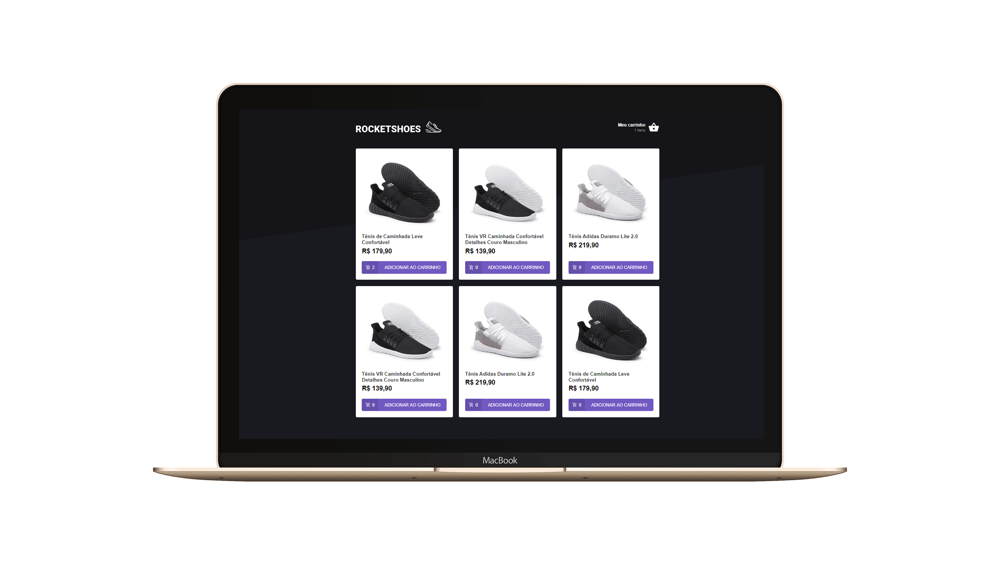

<h1 align="center">
    
</h1>

<h4 align="center">
   Rocketshoes - Your shoes to rock!
</h4>

 

  

## 💻 Project

An online shopping application using some shoes examples.

## :rocket: Techs

- [ReactJS]
- [Json-server]
- [Redux]
- [Reactotron]
- [Axios]
- [Immer]

---

☕ Glauber Brack - <a href="mailto:glauber@brack.com.br?Subject=Hello%20you">Mail me!</a> 
